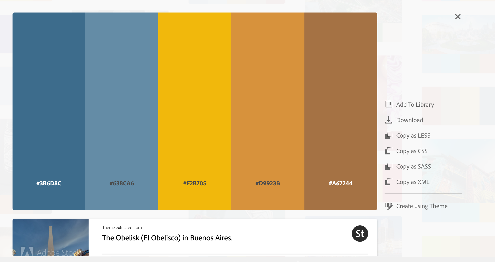
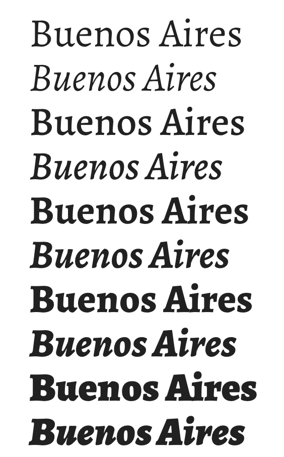
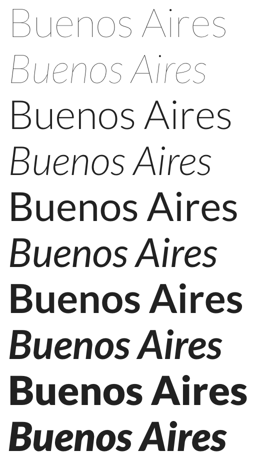

Dependencies:

If you haven't already, install nodejs on your machine.

Once that is finished enter the webapp directory and run 'npm install'. (This will take some time)

While this is happening, install python 3 if not already installed.

Again go to the webapp directory but this time run 'pip install -r requirements.txt'

Development environment:

To build the webapp, run 'npm run build'. However you would need to do this every time you want to see changes. If you want live updates, run 'npm run watch'.

To run the server, run the command 'python run.py'.

Use a browser to go to localhost:8080 and see your changes.

If just getting started with VueJS I suggest looking at the Single File Components already in the project and see how they are structured and how they are imported into the app proper in script.js.

** Important, to import your SFC the variable name must be the name of the file such that "buenosaires" is imported as Buenosaires. If you do not do it this way, the component will not be imported.

#### Color Theme:



```
/* Color Theme Swatches in Hex */
.The-Obelisk-(El-Obelisco)-in-Buenos-Aires.-1-hex { color: #3B6D8C; }
.The-Obelisk-(El-Obelisco)-in-Buenos-Aires.-2-hex { color: #638CA6; }
.The-Obelisk-(El-Obelisco)-in-Buenos-Aires.-3-hex { color: #F2B705; }
.The-Obelisk-(El-Obelisco)-in-Buenos-Aires.-4-hex { color: #D9923B; }
.The-Obelisk-(El-Obelisco)-in-Buenos-Aires.-5-hex { color: #A67244; }

/* Color Theme Swatches in RGBA */
.The-Obelisk-(El-Obelisco)-in-Buenos-Aires.-1-rgba { color: rgba(58, 109, 140, 1); }
.The-Obelisk-(El-Obelisco)-in-Buenos-Aires.-2-rgba { color: rgba(99, 140, 165, 1); }
.The-Obelisk-(El-Obelisco)-in-Buenos-Aires.-3-rgba { color: rgba(242, 182, 4, 1); }
.The-Obelisk-(El-Obelisco)-in-Buenos-Aires.-4-rgba { color: rgba(216, 145, 58, 1); }
.The-Obelisk-(El-Obelisco)-in-Buenos-Aires.-5-rgba { color: rgba(165, 113, 67, 1); }

/* Color Theme Swatches in HSLA */
.The-Obelisk-(El-Obelisco)-in-Buenos-Aires.-1-hsla { color: hsla(202, 40, 39, 1); }
.The-Obelisk-(El-Obelisco)-in-Buenos-Aires.-2-hsla { color: hsla(202, 27, 52, 1); }
.The-Obelisk-(El-Obelisco)-in-Buenos-Aires.-3-hsla { color: hsla(45, 96, 48, 1); }
.The-Obelisk-(El-Obelisco)-in-Buenos-Aires.-4-hsla { color: hsla(33, 67, 53, 1); }
.The-Obelisk-(El-Obelisco)-in-Buenos-Aires.-5-hsla { color: hsla(28, 41, 45, 1); }
```

### Fonts

#### Alegreya

```
font-family: 'Alegreya', serif;
<link href="https://fonts.googleapis.com/css?family=Alegreya" rel="stylesheet">
```

#### Lato
```
font-family: 'Lato', sans-serif;
<link href="https://fonts.googleapis.com/css?family=Lato" rel="stylesheet">
```


